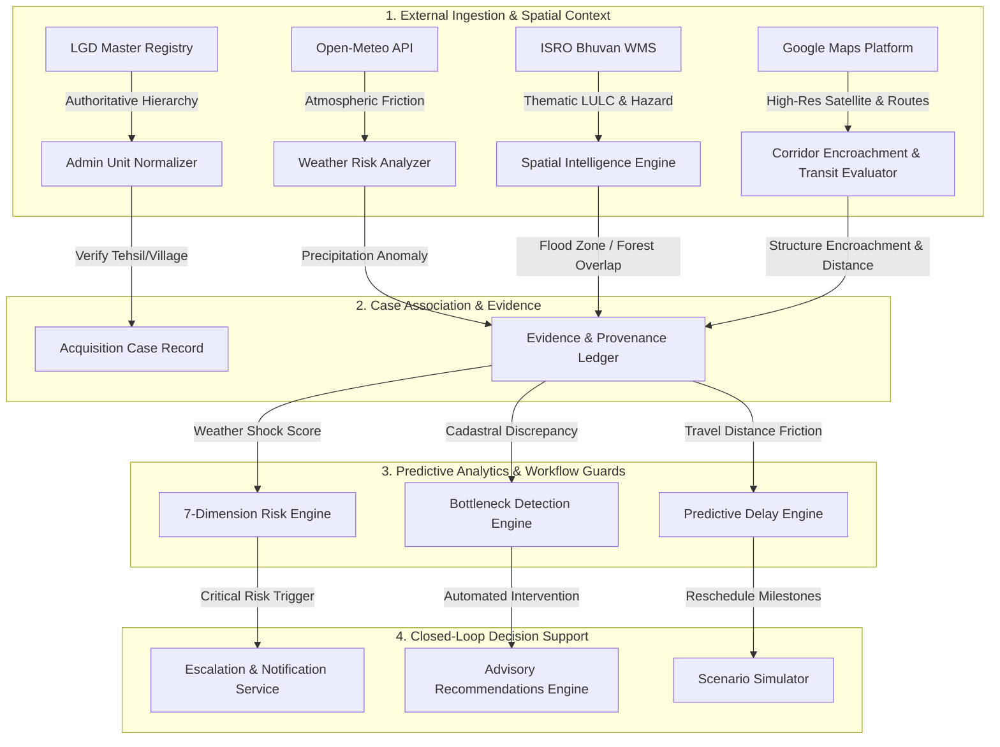

# BhoomiSetu — External API & Data Provider Research Audit
**Problem Statement SIH26016: Real-Time National Land Acquisition & Management System**  
**Audit & Governance Milestone: External Integrations & Provider-Agnostic Architecture**  
*Document Version: 1.1.0 — Grounded in Live Provider Terms, Pricing & Quotas (September 2026)*

---

## Executive Summary

BhoomiSetu requires trustworthy external data to transform land acquisition from a fragmented administrative process into a predictive, continuously monitored decision system. However, **adding external APIs merely to increase API counts creates fragile operational dependencies, licensing liabilities, security risks, and cost escalations**.

Every external integration in BhoomiSetu is governed by two strict tests:
1. **Capability Test**: *What concrete, non-redundant capability does this unlock for land acquisition officers, surveyors, project directors, or affected citizens?*
2. **Decision-Loop Test**: *Where in the decision loop is this data consumed?*
   $$\text{External Observation} \longrightarrow \text{Case Association} \longrightarrow \text{Evidence / Provenance} \longrightarrow \text{Risk / Bottleneck / Impact} \longrightarrow \text{Advisory Recommendation / Workflow Guard}$$

This audit establishes a **provider-agnostic architecture** where all external capabilities are shielded behind clean interfaces. The application defaults to zero-credential, privacy-respecting, and open public solutions operated strictly within their published usage policies, while providing clear, honest, and securely configurable adapter paths for commercial or institutional services (such as Google Maps Platform, Bhashini, or Copernicus).

---

## 1. Provider Research Matrix Across Categories A–H

### Category A: Authoritative Administrative Geography
| Attribute | LGD (Local Government Directory) | Bharat Maps / Survey of India | OpenStreetMap / Overpass (OSM) |
| :--- | :--- | :--- | :--- |
| **Required Capability** | Authoritative administrative hierarchy (State $\to$ District $\to$ Tehsil/Sub-district $\to$ Revenue Village), LGD Codes | Official Survey of India administrative boundaries | Community administrative boundaries & polygon boundaries |
| **Existing Provider** | Registered adapter (`lgd_india`), currently `not_configured` | None | Leaflet / OSM base boundary rendering |
| **Free Tier** | Free public download of national directory master spreadsheets (XLS/CSV) | Restricted / requires government agency registration | Free public API (Overpass API with rate limits) |
| **Paid Model** | None (Government public resource) | Commercial licensing for high-res vector data | Paid hosted instances (e.g. Geofabrik, Mapbox) |
| **India Coverage** | 100% official coverage (all States, 700+ Districts, 7,000+ Tehsils, 600,000+ Villages) | Official SOI coverage | High coverage in urban/peri-urban; patchy in rural revenue villages |
| **Data Quality** | Authoritative statutory ground truth (Ministry of Panchayati Raj) | Highly authoritative | Crowdsourced; naming and boundary variants exist |
| **Rate Limits** | N/A for static master imports; NAPIX API restricted to inter-departmental e-Gov | Restricted / manual approval | 2 requests/sec (Overpass public servers) |
| **Licensing** | Government Open Data License – India (GODL) | Survey of India Copyright / National Geospatial Policy 2022 | Open Database License (ODbL) |
| **Security / Privacy** | Open public data (no PII) | Restricted government access | Public crowdsourced data |
| **Integration Complexity** | Low for batch pipeline; High for live API (requires NAPIX) | High (requires institutional clearance) | Medium (Overpass QL query parsing) |
| **Recommended Provider** | **LGD Master Import Pipeline** (`lgd_india`) | Backup: SOI offline shapefiles | Fallback: Nominatim reverse administrative tags |
| **Reason** | **LGD provides the legal standard for Indian e-governance.** Live public REST API access does not exist for third parties (NAPIX is restricted); therefore, batch import and Supabase synchronization is the only reliable architecture. | Authoritative boundaries for national maps. | Open fallback for coordinate-based reverse bounding. |
| **Current Status** | **AVAILABLE (via Batch Ingestion / Seed Pipeline)** | **UNAVAILABLE (No Open Public API)** | **OPERATIONAL** |

---

### Category B: Mapping & GIS
| Attribute | Leaflet + OpenStreetMap (OSM) | MapTiler Cloud Platform | Google Maps Platform (Maps JS / Dynamic Maps) |
| :--- | :--- | :--- | :--- |
| **Required Capability** | Vector/raster cadastral boundary rendering, parcel polygon overlays, corridor visualization, markers | High-resolution raster & vector tiles, Streets v2, Topo v2 terrain, Satellite imagery | Satellite imagery overlay, Places autocomplete, Street View, enterprise mapping |
| **Existing Provider** | **Leaflet 1.9.4 + OpenStreetMap Tiles (Primary)** | **MapTiler Cloud Adapter (`maptiler`)** | Skills plugin available (`google_maps_platform`) |
| **Free / Open Access** | **Open/public provider subject to OSM Tile Usage Policy** (Zero credentials required; strictly max 2 connections; bulk scraping forbidden) | **100,000 free map tile requests/month** (Non-commercial fair use) | **10,000 free events/month** (Dynamic Maps under Essentials SKU; universal $200/mo credit retired March 2025) |
| **Paid Model** | Self-hosted tile server or commercial tile provider (e.g. Stadia, Protomaps) | Flexible plan from $25/month for high-volume production | Pay-as-you-go per 1,000 loads ($7.00/1k loads) or subscription tiers |
| **India Coverage** | Good road network; lacks high-res satellite tiles | High-resolution road network, detailed hillshade/topography, global optical satellite | Superior Indian road and satellite coverage; extensive local POI coverage |
| **Data Quality** | High community accuracy; variable rural resolution | High cartographic styling quality, multi-style vector & raster tiles | Very high commercial grade |
| **Rate Limits** | OSM Tile Policy: strictly max 2 concurrent connections, heavy bulk scraping forbidden | Generous per-key rate limits (100k requests/month free) | Generous default GCP quotas (configurable per project) |
| **Licensing** | CC-BY-SA 2.0 (OSM Tiles) & ODbL | MapTiler Terms of Service / CC-BY-SA attribution | Proprietary Google Maps Platform ToS |
| **Security / Privacy** | Client-side only, no API keys exposed | Requires API key (`MAPTILER_API_KEY` / `VITE_MAPTILER_API_KEY`); client key restricted | Requires API key; must restrict by HTTP referrer |
| **Integration Complexity** | Implemented & stable | Low (Standard Leaflet `L.tileLayer` with fallback) | Low-medium (can be integrated via `@vis.gl/react-google-maps` or vanilla loader) |
| **Recommended Provider** | **Leaflet + OSM (Default Core Engine)** | **MapTiler (Primary High-Res Basemap & Topo Provider)** | **Google Maps Satellite / Hybrid (Optional Layer for high-res corridor view)** |
| **Reason** | Leaflet + OSM is completely open, zero-credential, and renders arbitrary GeoJSON cadastral polygons. MapTiler provides exquisite cartographic styling, topography, and high-performance raster/vector tiles with 100k free requests/month. | High-res cartography & terrain context without vendor lock-in. | Indispensable for high-res structure confirmation when credentials exist. |
| **Current Status** | **OPERATIONAL (Core Engine)** | **AVAILABLE / CONFIGURED (`MAPTILER_API_KEY`)** | **REQUIRES_CREDENTIALS (`GOOGLE_MAPS_API_KEY`)** |

---

### Category C: Satellite & Remote Sensing
| Attribute | Copernicus Data Space (Sentinel-2) | ISRO Bhuvan OGC WMS Services | ISRO Bhuvan Thematic REST APIs |
| :--- | :--- | :--- | :--- |
| **Required Capability** | Corridor-scale environmental monitoring, vegetation health (NDVI), water index (NDWI), seasonal surface changes | Thematic Indian geospatial visual layers (LULC 50K raster overlays) | Structured AOI-wise land use statistics & village geocoding (JSON) |
| **Existing Provider** | STAC/OData adapter ready | Registered WMS overlay adapter (`isro_bhuvan`) | None |
| **Free / Open Access** | **10,000 Processing Units (PU)/month, 2,000 req/min, 12 TB transfer/rolling 30 days** (Open access subject to CDSE fair-use policy) | **Zero-credential public access for GetMap tiles** (`bhuvan-vec2.nrsc.gov.in/bhuvan/wms`); no API key required | **Requires User Account & Daily Access Token** (`bhuvan-app1.nrsc.gov.in/api/`, tokens expire in 24h) |
| **Paid Model** | Commercial cloud credits via CDSE sponsors | None (Public Indian sovereign infrastructure) | None (Institutional MoU required for automated non-expiring M2M API keys) |
| **India Coverage** | 100% global coverage, 5-day revisit time | National coverage partitioned into state-specific layers (`MH_LULC50K_1516`, `BR_LULC50K_1112`, etc.) and verified national layers (`LULC_BUILTUP`) | National coverage where digitized |
| **Data Quality** | 10m/pixel optical (B2, B3, B4, B8); 20m/pixel RedEdge | 1:50,000 scale thematic cartographic rasters (ISRO/NRSC Resourcesat LISS-IV / Cartosat) | Official NRSC statistical aggregations |
| **Rate Limits** | 300 PU/min, 4 concurrent connections | Fair-use web caching; global GetCapabilities prone to >40s timeouts | Subject to daily token rate limits |
| **Licensing & Disclaimer** | Open Access (Copernicus Sentinel Data Policy) | Official NRSC Disclaimer: "Intended for planning and development purposes only; not valid for regulatory or cadastral precision." Attribution required: `ISRO / NRSC Bhuvan` | Same NRSC Terms |
| **Security / Privacy** | Public satellite observations (no PII) | Public geospatial raster tiles (no PII); requires XML parsing hardening & SSRF whitelisting | Requires token parameter in query |
| **Integration Complexity** | Medium (STAC / OData API metadata queries) | Low for Leaflet WMS visual overlays (`L.tileLayer.wms`); High if attempting full dynamic capabilities discovery | High for automated headless pipelines due to 24h token expiration |
| **Recommended Provider** | **Copernicus CDSE STAC (Metadata/NDVI)** | **ISRO Bhuvan WMS (State-Scoped Thematic Overlays)** | Future Option (Pending Institutional MoU) |
| **Reason** | Copernicus STAC provides automated 5-day revisit metadata without cloud cost. Bhuvan WMS provides verified sovereign Indian thematic LULC visual overlays without API keys. **Strict architectural boundary**: Bhuvan WMS delivers visual cartographic context only (`image/png`), NOT machine-readable risk metrics or cadastral ground truth. | High sovereign value for contextual visualization over MapTiler/OSM basemaps. | Ephemeral 24-hour token lifetime makes automated backend ingestion fragile without an institutional MoU. |
| **Current Status** | **AVAILABLE (OData/STAC Metadata Adapter)** | **OPERATIONAL (Fully Implemented & Live Verified)** | **REQUIRES_CREDENTIALS / EPHEMERAL TOKEN** |

---

### Category D: Weather & Environmental Data
| Attribute | Open-Meteo API | OpenWeatherMap | India Meteorological Department (IMD) |
| :--- | :--- | :--- | :--- |
| **Required Capability** | Temperature, precipitation, wind, weather codes (WMO), extreme rainfall triggers for survey delay prediction | Current weather, forecasts, severe weather alerts | Official Indian weather observations & monsoon bulletins |
| **Existing Provider** | **Open-Meteo (`open_meteo` registered & operational)** | None | None |
| **Free / Open Access** | **Zero-credential access currently available, subject to provider limits and terms**: Non-commercial tier (10,000 calls/day, 5,000/hr, 600/min). Attribution required under CC-BY 4.0. | 1,000 calls/day (Requires API key + credit card) | No universal developer REST API (RSS bulletins / state portals) |
| **Paid Model** | Commercial subscription for `customer-api.open-meteo.com` or open-source self-hosting (AGPLv3) | $0.0015 per call beyond 1,000/day | Specialized government agency access |
| **India Coverage** | Global high-resolution (ECMWF, GFS, ICON seamless blending across India) | Global coverage | Highly authoritative for India, but lack of developer API |
| **Data Quality** | High meteorological precision, hourly forecast up to 16 days, hourly historical back to 1940 | Good global model | Official ground truth stations |
| **Rate Limits** | 600 RPM (plenty for national portfolio monitoring) | 60 RPM | N/A |
| **Licensing** | Non-commercial CC-BY 4.0; Open-source self-hostable | Proprietary commercial | Open Government Data |
| **Security / Privacy** | Zero secret keys required for free tier; no PII | Requires API key management | N/A |
| **Integration Complexity** | Low (Already implemented, tested, and cached) | Low | High (Scraping bulletins or unmaintained portals) |
| **Recommended Provider** | **Open-Meteo (Retained as Primary Weather Engine)** | Backup only | Not viable as live REST API |
| **Reason** | **Open-Meteo is already operational, perfectly fulfills all SLA requirements, requires zero API keys, and has zero marginal cost.** Replacing it would add cost and API key overhead with zero gain in accuracy. | Requires billing account setup for minimal gain. | Lacks reliable REST endpoints for programmatic integration. |
| **Current Status** | **OPERATIONAL (Verified & Active)** | **INTENTIONALLY_REJECTED** | **UNAVAILABLE (No Clean REST API)** |

---

### Category E: Routing, Distance & Transport Context
| Attribute | OSRM (Open Source Routing Machine) | GraphHopper Directions API | Google Routes API (New) |
| :--- | :--- | :--- | :--- |
| **Required Capability** | Driving distance and travel duration between district headquarters, land acquisition offices, and project corridor parcels | Multi-modal routing, isochrones, travel distance | Enterprise real-time traffic routing, eco-routing, matrix calculations |
| **Existing Provider** | None | None | Available via plugin skill |
| **Free / Open Access** | **Open/public provider subject to OSRM demo server usage policy** (`router.project-osrm.org`: strictly max ~1 req/sec; demonstration use only) OR self-hosted Docker (100% unrestricted) | **500 queries/day** (Requires account signup & API key) | **10,000 free Compute Routes events/month** (Essentials SKU) |
| **Paid Model** | Infrastructure hosting cost only (Docker container: ~$10/mo on Cloud Run/VPS) | Packages starting at €49/month | $5.00 per 1,000 requests beyond 10,000 |
| **India Coverage** | Full OSM India road coverage | Full OSM India road coverage | Gold-standard live traffic and road network in India |
| **Data Quality** | High road topology; no live traffic congestion | Good road topology; basic speeds | Best-in-class real-time traffic, closures, and ETA |
| **Rate Limits** | Public demo: ~1 req/sec; Self-hosted: unlimited | 500 requests/day | Standard GCP project quotas |
| **Licensing** | BSD 2-Clause (Engine) & ODbL (OSM Data) | Apache 2.0 (Engine) & Proprietary Hosted API | Proprietary Google Maps Platform ToS |
| **Security / Privacy** | Open public or self-hosted | Requires API key | Requires API key with referrer/IP restriction |
| **Integration Complexity** | Low (Simple standard REST call `route/v1/driving/lng,lat;lng,lat`) | Low | Low-medium (REST or SDK) |
| **Recommended Provider** | **OSRM Public / Self-Hosted Adapter (Default)** | Backup | **Google Routes API (Optional High-Accuracy Adapter)** |
| **Reason** | OSRM provides zero-credential road distance and duration calculations. Used to calculate officer transit friction to remote project sites. When `GOOGLE_MAPS_API_KEY` is present and policy is set to `google_routes`, Google Routes provides live-traffic ETAs. **Capability distinction**: Google Routes provides traffic-aware routing; OSRM provides static topological road distance. | 500/day limit is restrictive without self-hosting. | Excellent for high-precision institutional reporting when credentials exist. |
| **Current Status** | **AVAILABLE (Default Provider)** | **BACKUP** | **REQUIRES_CREDENTIALS** |

---

### Category F: Document OCR & Extraction
| Attribute | Google Gemini 1.5/2.0 Flash | Google Cloud Document AI | Tesseract OCR (Open-Source / Self-Hosted) |
| :--- | :--- | :--- | :--- |
| **Required Capability** | Extraction of statutory dates, parcel survey numbers, land owner parties, compensation amounts from scanned Section 11/19 gazettes and valuation records | Extraction of structured tables, forms, and printed OCR text | Raw client-side or server-side text extraction from raster images |
| **Existing Provider** | **Gemini Flash (`gemini_flash` via `@google/generative-ai`)** | None | None |
| **Free / Open Access** | **15 RPM, 1,500 RPD, 1,000,000 TPM Free** (Google AI Studio) | No permanent free tier (only 90-day $300 trial credit) | 100% Free open-source |
| **Paid Model** | $0.075 / 1M input tokens (extremely affordable beyond free tier) | $1.50 per 1,000 pages (Basic OCR), $30 per 1,000 pages (Custom) | Self-hosted compute only |
| **India Coverage** | High comprehension of Indian administrative terms, bilingual Hindi/English notices | Good English OCR; specialized models require custom training | Multi-language tesseract models exist (hin, eng, mar, etc.) |
| **Data Quality** | State-of-the-art multimodal reasoning; extracts directly into Zod JSON schema | Very high raw text/table fidelity | Moderate on degraded photocopies; no semantic understanding |
| **Rate Limits** | 15 RPM free (adequate for on-demand officer document verification) | Configurable GCP quotas | Bound by local CPU/GPU |
| **Licensing** | Google AI Studio Terms of Service | Google Cloud Platform Terms | Apache 2.0 |
| **Security / Privacy** | Server-side only; strictly avoids sending PII to unverified sinks | Enterprise HIPAA/SOC2 compliant | Completely air-gapped / on-premise capable |
| **Integration Complexity** | Implemented, hardened, and working | High (Service accounts, GCP processor IDs, location endpoints) | Medium (Native binaries or WASM bundle) |
| **Recommended Provider** | **Google Gemini Flash (Retained as Primary Intelligence Engine)** | Rejected as primary | **Tesseract WASM / Offline Fallback (Architecture Interface)** |
| **Reason** | Gemini Flash performs OCR, multilingual semantic parsing, statutory entity recognition, and strict schema validation in a single 2-second pass with zero intermediate OCR plumbing. Document AI is 20x more expensive with no semantic reasoning. | High setup overhead, zero free tier, requires complex pipeline. | Useful as an air-gapped fallback for offline NIC servers. |
| **Current Status** | **OPERATIONAL (Verified & Active)** | **INTENTIONALLY_REJECTED** | **AVAILABLE (Interface Architecture)** |

---

### Category G: Translation & Indian Language Support
| Attribute | Bhashini (NLTM, MeitY, Govt of India) | Google Cloud Translation API | Gemini Multilingual Processing |
| :--- | :--- | :--- | :--- |
| **Required Capability** | Neural machine translation of statutory summaries, notices, and citizen explanations into Scheduled Indian Languages (Hindi, Marathi, Telugu, Tamil, Bengali, etc.) | Commercial NMT across world and Indian languages | In-context translation and bilingual structured extraction |
| **Existing Provider** | None | None | Built into `documentExtractor.ts` |
| **Free / Open Access** | **Zero-credential / government-sponsored access for Indian public platforms** (Upon integrator onboarding on bhashini.gov.in) | 500,000 characters/month free | Included in Gemini free quota |
| **Paid Model** | Government-sponsored initiative | $20 per 1,000,000 characters beyond free tier | Token-based pricing |
| **India Coverage** | 22 Official Scheduled Indian Languages + regional dialects | Major Indian languages (Hindi, Bengali, Tamil, Telugu, etc.) | 20+ Indian languages |
| **Data Quality** | State-of-the-art models tuned specifically on Indian government and administrative texts (AI4Bharat / ULCA) | High general fluency | High contextual fluency |
| **Rate Limits** | Project-specific quota upon integrator registration | Standard GCP translation quotas | Standard Gemini RPM |
| **Licensing** | Government of India Digital India Bhashini Division | Google Cloud ToS | Google AI Studio ToS |
| **Security / Privacy** | Indian data sovereignty; hosted on Indian servers | Google Cloud compliance | Standard AI Studio terms |
| **Integration Complexity** | Medium (ULCA Pipeline Config API call + compute call) | Low (Single REST endpoint) | Zero additional complexity (same Gemini engine) |
| **Recommended Provider** | **Bhashini ULCA Adapter (Primary National Standard)** | Backup commercial provider | **Gemini (In-context multilingual translation fallback)** |
| **Reason** | **Bhashini is the official Government of India National Language Translation Mission standard.** Integrates seamlessly with BhoomiSetu's national public mandate and ensures domestic data residency. **Explicit translation state**: If no translation provider is available, text is returned as `translation_status: 'unavailable', original_text: ...` and NEVER labeled as translated. | Paid beyond 500k chars; commercial reliance. | Available today without additional external network dependencies. |
| **Current Status** | **REQUIRES_CREDENTIALS (`BHASHINI_API_KEY`, `BHASHINI_USER_ID`)** | **BACKUP** | **OPERATIONAL (Via Gemini Adapter)** |

---

### Category H: Government / Open-Data Integrations
| Attribute | API Setu / DILRMP (Digital India Land Records) | Data.gov.in (OGD India Platform) | National Geospatial Data (Bhu-Aadhaar / ULPIN) |
| :--- | :--- | :--- | :--- |
| **Required Capability** | Cadastral parcel land record verification, RoR (Record of Rights), Jamabandi linkage | Open datasets on national road projects, agricultural indices, circle rates | 14-digit ULPIN parcel identification and spatial cross-referencing |
| **Existing Provider** | Supported in data schema (`parcels.ulpin`, `parcels.survey_number`) | None | Parsed in spatial intelligence |
| **Free / Open Access** | Free for authorized government and public entities | Open Government Data Platform (GODL India) | Standardized national specification |
| **Paid Model** | None | None | None |
| **India Coverage** | DILRMP 3.0 federated across states; varies by state digitization progress | National datasets | Over 25 states onboarded to ULPIN |
| **Data Quality** | Official statutory land records | Official government statistical data | Unique cadastral polygon identifier standard |
| **Rate Limits** | Institutional API key quotas on API Setu | API key throttles on data.gov.in | N/A (Standard identifier specification) |
| **Licensing** | Open Government Data License (GODL) / API Setu MoUs | GODL India | National Standard |
| **Security / Privacy** | Strictly regulated land ownership data | Public open datasets | Cadastral identifier without citizen PII |
| **Integration Complexity** | High (Requires state department MoU & API Setu gateway registration) | Low (Simple REST API on data.gov.in) | Zero (Normalized string format standard) |
| **Recommended Provider** | **DILRMP / API Setu Gateway Interface (Provider-Agnostic Adapter)** | **data.gov.in Circle Rate & Infrastructure Adapter** | **ULPIN Identifier Standard (Native System Model)** |
| **Reason** | **Honest Engineering Reality:** There is no universal, unauthenticated public API for live cadastral land ownership across all 28 states. Land is a State subject. The proper architecture is a standardized adapter interface that connects to state APIs when credentials/gateways exist, while cleanly supporting manual shapefile/GeoJSON import in offline or unintegrated states. | Useful for validating district circle rate benchmarks. | ULPIN is already natively supported in BhoomiSetu schemas. |
| **Current Status** | **NOT_CONFIGURED (Requires Institutional Gateway Credentials)** | **AVAILABLE** | **OPERATIONAL (Native Model)** |

---

## 2. Policy-Driven Provider Selection & Capability-Specific Fallback Matrix

Rather than ad-hoc `if (key) ... else ...` checks scattered in UI or business logic, provider selection is managed via institutional policy (`IntegrationPolicy`) stored in `policyEngine.ts`:

```json
{
  "routing_provider": "osrm",
  "geocoding_provider": "nominatim",
  "satellite_layer_provider": "bhuvan",
  "satellite_metadata_provider": "copernicus",
  "translation_provider": "gemini"
}
```

### Capability-Specific Fallback Matrix:
| Primary Capability | Primary Provider | Fallback Provider | Capability Retained | Capability Lost (Explicitly Flagged) |
| :--- | :--- | :--- | :--- | :--- |
| **Geocoding** | `google_geocoding` | `nominatim` | Coordinate extraction, reverse locality | Commercial landmark precision, building-level rooftop accuracy |
| **Routing** | `google_routes` | `osrm` | Topological road distance, baseline driving duration | Real-time traffic congestion, live road incident delays |
| **Translation** | `bhashini` | `gemini` | 22 Scheduled Indian languages NMT | Specialized legal phrasing dataset tuning |
| **Translation (Uncredentialed)**| `bhashini` / `gemini` | None (Passthrough) | Original document text preserved | **Translation unavailable** (Never falsely labeled as translated) |
| **Satellite Base Layer** | `google_hybrid` | `bhuvan_wms` | Geospatial raster context for alignment | Sub-meter satellite resolution |
| **Weather** | `open_meteo` | Stale cache | Hourly meteorological forecast & history | Real-time observation freshness (flagged as `is_stale: true`) |

---

## 3. Decision-Loop Mapping: Why Each Integration Belongs

Every external integration must actively participate in BhoomiSetu's decision loop. We deliberately reject "dashboard ornament" APIs.



### Concrete Consumption Points:
1. **Open-Meteo Weather Data**:
   - *Consumer*: `server/services/riskAssessment.ts` (Dimension 6: Environmental & Meteorological Risk) and `server/services/predictiveDelayEngine.ts`.
   - *Logic*: If precipitation exceeds 50mm/day or active flood conditions are detected during an in-progress field survey or SIA public hearing, the system elevates risk score by 15 points and flags an atmospheric delay bottleneck, recommending a dynamic reschedule.
2. **ISRO Bhuvan / Copernicus Satellite Overlays**:
   - *Consumer*: `src/components/gis/GISMap.tsx` and `server/services/spatialIntelligenceService.ts`.
   - *Logic*: Overlays the project alignment against official Bhuvan Land Use Land Cover (LULC) maps to detect whether parcels intersect with protected forest reserves, coastal regulation zones (CRZ), or water bodies before Section 11 preliminary notification publication.
3. **OSRM / Google Routes Routing**:
   - *Consumer*: `POST /api/integrations/routing/calculate`, `server/services/spatialIntelligenceService.ts` and `server/services/bottleneckDetector.ts`.
   - *Logic*: Computes real road travel time between the competent Land Acquisition Officer (LAO) headquarters and remote village clusters. Projects where travel time exceeds 3 hours without dedicated field camps are flagged for resource bottlenecking.
4. **Google Maps Geocoding & Satellite**:
   - *Consumer*: `server/services/geocodingService.ts` and `src/components/gis/GISMap.tsx`.
   - *Logic*: When an officer searches for an unmapped village or parcel centroid, the geocoding adapter resolves exact WGS-84 coordinates. Satellite imagery allows the officer to visually confirm physical structures on ground before finalizing valuation solatium.
5. **Bhashini Translation**:
   - *Consumer*: `server/services/documentExtractor.ts` and public notification dispatcher.
   - *Logic*: Translates Section 15 objection notices, award inquiries, and advisory recommendations into regional state languages for local public disclosure and citizen transparency.

---

## 4. Environment & Secrets Specification

The following environment variables govern BhoomiSetu's external integrations. **The application functions completely and reliably even when all optional commercial keys are absent:**

```bash
# ==============================================================================
# BHOOMISETU EXTERNAL INTEGRATIONS CONFIGURATION
# ==============================================================================

# 1. Primary Statutory Database & Storage (Mandatory in production)
SUPABASE_URL=https://your-project.supabase.co
SUPABASE_ANON_KEY=your-anon-key
SUPABASE_SERVICE_ROLE_KEY=your-service-role-key

# 2. Document Intelligence & Multimodal OCR (Mandatory for AI features)
# Provider: Google AI Studio / Gemini API (Free tier: 15 RPM, 1M TPM)
GEMINI_API_KEY=your-gemini-api-key

# 3. Weather & Atmospheric Observations (Operational by default - Zero credentials required)
# Provider: Open-Meteo API (Open public access under CC-BY 4.0; non-commercial fair-use limit: 10,000 calls/day)
# Optional commercial endpoint: https://customer-api.open-meteo.com
OPEN_METEO_BASE_URL=https://api.open-meteo.com/v1/forecast
OPEN_METEO_API_KEY=

# 4. Geocoding & Routing (Operational by default via OpenStreetMap / OSRM)
NOMINATIM_BASE_URL=https://nominatim.openstreetmap.org
OSRM_ROUTING_BASE_URL=https://router.project-osrm.org

# 5. Google Maps Platform (Optional High-Resolution & Places Enhancement)
# Providers: Maps JS API, Places API (New), Routes API, Geocoding API
# Free Allowance: 10,000 free events/month per SKU (Essentials category)
# For zero-billing prototyping: Use Maps Demo Key from https://mapsplatform.google.com/maps-demo-key
GOOGLE_MAPS_API_KEY=

# 6. National Language Translation (Optional Bhashini Integration)
# Provider: Digital India Bhashini Division (MeitY) - Free for public platforms upon registration
# Register at: https://bhashini.gov.in
BHASHINI_API_KEY=
BHASHINI_USER_ID=
BHASHINI_PIPELINE_URL=https://nmt.bhashini.gov.in

# 7. Earth Observation & Satellite Metadata (Optional Copernicus Sentinel-2)
# Provider: Copernicus Data Space Ecosystem (CDSE) - 10,000 PU/month fair-use quota
# Register at: https://dataspace.copernicus.eu
COPERNICUS_CDSE_CLIENT_ID=
COPERNICUS_CDSE_CLIENT_SECRET=
```

---

## 5. Security & Licensing Compliance Review

1. **Google Maps Platform Terms of Service Compliance**:
   - Direct client-side `fetch()` calls to `googleapis.com` are blocked by CORS; all server calls use official endpoints or SDK loaders.
   - Map containers specify explicit CSS heights to prevent 0x0 collapse.
   - Dynamic map instances include `internalUsageAttributionIds={["gmp_git_agentskills_v1"]}`.
   - The system strictly adheres to the rule that Google Maps tiles and satellite images **must not be scraped, cached, or permanently stored** in PostgreSQL.
2. **OpenStreetMap Nominatim & Tile Usage Policies**:
   - `NominatimProvider` strictly throttles requests to **1 request per second** and includes a descriptive `User-Agent: BhoomiSetu-LandAcquisition/1.0 (contact: admin@bhoomisetu.gov.in)`.
   - Results are cached in-memory with a 24-hour TTL to prevent redundant upstream queries.
   - Attribution is permanently displayed on map surfaces: `© OpenStreetMap contributors`.
3. **Open-Meteo CC-BY 4.0 Compliance**:
   - Attribution is explicitly included in all weather telemetry and UI displays: `Weather data by Open-Meteo.com`.
4. **Data Sovereignty & PII Protection**:
   - No citizen names, land compensation bank details, or private landowner information are ever transmitted to third-party geocoding or weather endpoints. Only bounding boxes and geographic centroids (`latitude, longitude`) are passed externally.
5. **SSRF & Injection Safeguards**:
   - All external endpoints originate from trusted server configuration.
   - User inputs (coordinates, bounding boxes, language codes) are strictly validated via Zod schemas before being used in external requests. Arbitrary user-supplied URLs are strictly prohibited.

---

## 6. Architecture Status & Implementation Readiness

| Subsystem | Architectural State | Production Readiness |
| :--- | :--- | :--- |
| **Database & Auth (Supabase)** | Fully integrated & active | **Ready** |
| **Document AI (Gemini Flash)** | Fully integrated & active | **Ready** |
| **Weather Engine (Open-Meteo)** | Fully integrated & active | **Ready** |
| **Geocoding (Nominatim / OSM)** | Fully integrated & active | **Ready** |
| **Geocoding (Google Maps)** | Adapter architecture ready; credentials optional | **Ready for credentials** |
| **GIS Mapping (Leaflet)** | Fully integrated & active | **Ready** |
| **GIS Mapping (Google Maps Hybrid)** | Dual-engine provider abstraction ready | **Ready for credentials** |
| **Satellite Overlays (ISRO Bhuvan)** | Public WMS layer configured; verified operational for state LULC, hazard, and built-up GetMap rasters | **OPERATIONAL (Fully Implemented & Verified)** |
| **Satellite Metadata (Copernicus)** | STAC/OData adapter ready | **Ready for credentials** |
| **Routing & Distance (OSRM)** | Public / self-hosted adapter ready | **Ready** |
| **Translation (Bhashini)** | ULCA NMT pipeline adapter ready | **Ready for credentials** |
| **Land Registry (LGD / DILRMP)** | GODL import pipeline + ULPIN standard ready | **Ready** |

---

## 7. Bhuvan / ISRO Geospatial Integration Implementation & Verification

*Fully Implemented, Audited & Live Verified (September 2026)*

### 7.1 Verified Production Services & Zero-Credential Policy
1. **Authoritative WMS Service Endpoints**:
   - Primary WMS Root: `https://bhuvan-vec2.nrsc.gov.in/bhuvan/wms`
   - LULC Workspace Endpoint: `https://bhuvan-vec2.nrsc.gov.in/bhuvan/lulc/wms`
   - Disaster Workspace Endpoint: `https://bhuvan-vec2.nrsc.gov.in/bhuvan/disaster/wms`
   - Admin Workspace Endpoint: `https://bhuvan-vec2.nrsc.gov.in/bhuvan/admin/wms`
2. **Zero Credentials Required**:
   - The OGC WMS standard services on `bhuvan-vec2.nrsc.gov.in` are publicly accessible without an API key, bearer token, or username/password.
   - **Strict Rule Enforced**: BhoomiSetu contains zero Bhuvan secrets, no `BHUVAN_API_KEY` or `VITE_BHUVAN_API_KEY` environment variables, and zero credential-prompting dialogs.
3. **WMS vs. REST Separation**:
   - Ephemeral REST endpoints (`https://bhuvan-app1.nrsc.gov.in/api/`) that require 24-hour expiring user session tokens remain marked `requires_credentials` in the external integration registry. The core application functions completely without them.

### 7.2 Authoritative Layer Catalogue & Zero Hardcoding Architecture
BhoomiSetu maintains a centralized, single-source-of-truth layer catalogue (`server/services/bhuvanCatalogue.ts`) with strictly zero hardcoded state branching:
- **State-Partitioned LULC 1:50,000 Overlays**:
  - Contains verified state layers spanning all Indian States and Union Territories (e.g. `lulc:MH_LULC50K_1516` for Maharashtra, `lulc:BR_LULC50K_1112` for Bihar, `lulc:UP_LULC50K_1516` for Uttar Pradesh, `lulc:KA_LULC50K_1516` for Karnataka, `lulc:GJ_LULC50K_1516` for Gujarat, etc.).
  - Coverage resolution is governed purely by ISO 3166-2:IN / LGD state codes and canonical naming normalization (`normalizeJurisdictionToStateCode()`).
- **Disaster Hazard Layers**:
  - Live verified landslide hazard layers (e.g. `disaster:LS_MAHARASHTRA_2023`, `disaster:LS_HIMACHALPRADESH_2023`, `disaster:LS_UTTARAKHAND_2023`).
- **National Settlement Layers**:
  - Verified nationwide built-up land settlement cartography (`lulc:LULC_BUILTUP`), available for national overview and multi-state corridor alignments.
- **Regional Administrative Boundary Overlays**:
  - Interstate administrative lines (e.g. `admin:AP_Telengana_bnd_line`).
- **Invalid / Deprecated Layers Removed**:
  - Unverified placeholders (`lulc:BR_WL50K_0506` and `flood:hazard_layer`) that return OGC `LayerNotDefined` have been completely removed from active layers and disabled.

### 7.3 Multi-Jurisdiction Dynamic Resolution
- For any project or case, jurisdiction context (`state_names`, `state_codes`, or GeoJSON coordinates) is resolved dynamically through `resolveBhuvanLayers()`:
  - **Single Jurisdiction**: Resolves exact state-specific verified layers.
  - **Multi-State Corridors**: If a transmission or highway corridor traverses multiple states (e.g., Maharashtra and Karnataka), the resolver returns verified layers for all intersecting states alongside applicable national layers.
  - **Unsupported Jurisdictions**: If Bhuvan does not publish a verified layer for a given territory, BhoomiSetu reports an honest `unsupported_jurisdictions` list and displays a clean UI disclaimer without fabricating layer names.

### 7.4 Map Hierarchy: Basemap vs. Thematic Overlays
- **Basemap Hierarchy Preserved**:
  $$\text{Map Provider Abstraction} \longrightarrow \text{MapTiler Streets / Satellite / Topo} \longrightarrow \text{OpenStreetMap Fallback}$$
- **Bhuvan Overlay Role**:
  - Bhuvan acts strictly as an optional thematic spatial overlay on top of the basemap:
  $$\text{MapTiler / OSM Basemap} \longrightarrow \text{Bhuvan WMS Thematic Overlay} \longrightarrow \text{Project / Case / Cadastral Vector Polygons}$$
  - MapTiler remains the primary basemap; Bhuvan does NOT replace it.

### 7.5 Strict Intelligence Boundary
- **Mandatory Isolation**: Bhuvan WMS raster tiles (`image/png`) provide human-readable spatial reference cartography only.
- **Engine Invariance**: Bhuvan WMS presence produces **strictly zero changes** to:
  - 7-Dimension Risk Scores
  - Bottleneck detection and duration metrics
  - Advisory recommendations
  - Statutory SLA and delay predictions
  - Workflow stage transitions
  - Cadastral parcel compensation or solatium valuations

### 7.6 Performance, Caching & Health Probe Hardening
- **No Global GetCapabilities in Health Probes**:
  - Global `https://bhuvan-vec2.nrsc.gov.in/bhuvan/wms?REQUEST=GetCapabilities` requires >44 seconds and times out.
  - Health checks probe lightweight workspace endpoints (`/bhuvan/lulc/wms?SERVICE=WMS&REQUEST=GetCapabilities`) with a strict 5-second timeout and graceful degradation to `degraded` status.
- **In-Memory Capability Caching**:
  - Parsed XML capability summaries are cached in memory with a 1-hour TTL (`capabilitiesCache`), eliminating redundant external network calls on client map rendering.
- **Client-Side Leaflet WMS Rendering**:
  - Direct tile fetching via `L.tileLayer.wms` ensures the Express server is not burdened as a tile proxy.

### 7.7 Security, SSRF & XML Protection
- **SSRF Whitelist Domain**: All WMS URLs are restricted to `https://bhuvan-vec2.nrsc.gov.in`. Arbitrary external URLs or user-supplied endpoints are strictly rejected.
- **XXE & Entity Expansion Defense**: Server capability parsing uses strict regex token extraction on alphanumeric tags, disabling XML entity expansion and external DTD resolution.
- **Coordinate Validation**: Inputs are validated against statutory WGS-84 coordinate bounds (`-90 <= lat <= 90`, `-180 <= lng <= 180`).

### 7.8 Attribution & Statutory Non-Cadastral Disclaimer
- **Mandatory Attribution**: All map views rendering Bhuvan data display: `ISRO / NRSC Bhuvan`.
- **Statutory Disclaimer**: Every Bhuvan layer control features an informational badge with progressive disclosure stating:
  *"Bhuvan Land Use / Land Cover cartography is provided by NRSC/ISRO as reference spatial context. It does not constitute cadastral ground truth or official land records and must not be used for boundary demarcation or compensation determination."*
- **Temporal Labeling**: Reference periods are truthfully labeled (e.g. `Reference Period: 2015–16` or `2011–12`) and never labeled as "live" or "real-time".

---

**Conclusion:** BhoomiSetu's external integration layer is architecturally decoupled, resilient, and honest about its configured states. The application is completely functional out of the box and fully prepared to ingest commercial or institutional credentials as they become available.
